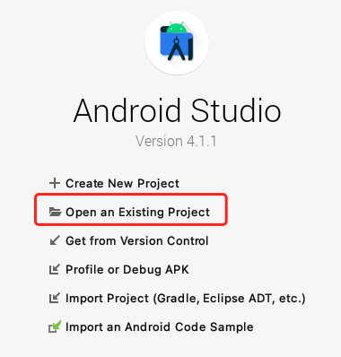
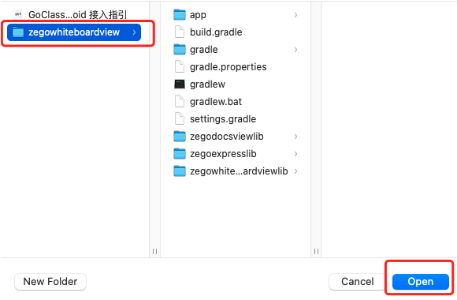
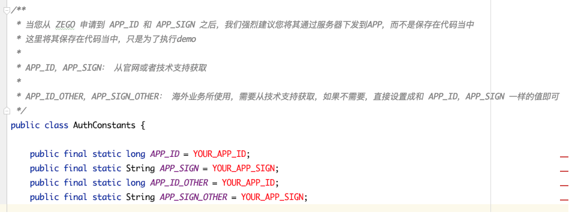
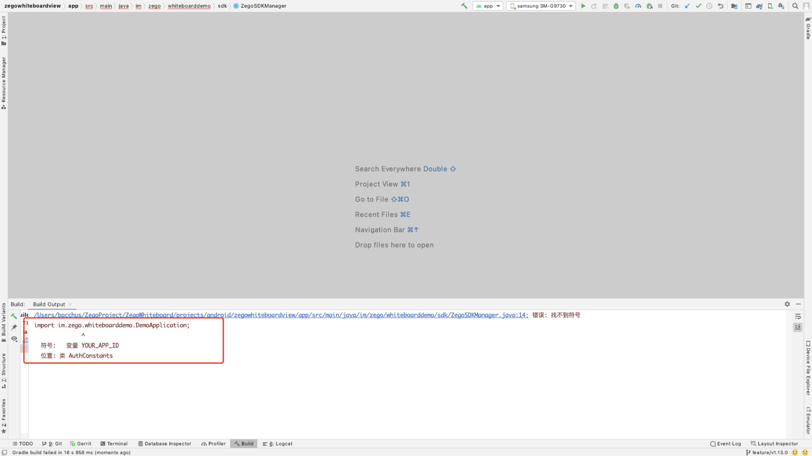

# 简介

go_class_android 是一个集成即构 Express-Video SDK，互动白板和文件共享的功能示例项目，目的是提供一个场景让用户可以更具像化的了解即构的互动白板和文件共享的功能和使用场景。开发人员可以参考该项目，实现自己的项目。本项目是采用 Java 以及 Kotlin 编程语言开发出来的 Android 应用。

# 开发准备

#### 申请 AppID 与 AppSign
请在 [即构管理控制台](https://console.zego.im/acount) 申请 SDK 初始化需要的 AppID 和 AppSign，[获取 AppID 和 AppSign 指引](https://doc.zego.im/API/HideDoc/GetAppIDGuide/GetAppIDGuideline.html) 。
#### AppID
应用ID，请从 [即构管理控制台](https://console.zego.im/acount) 获取

#### 准备环境
请确保开发环境满足以下技术要求（以下说明皆以 MacOS 开发电脑为例)：

- Android Studio 3.0 或以上版本。
- 已经下载 Android SDK 28 和 Android SDK Platform-Tools 28.*.*。
- Android 版本不低于 5.0 且支持音视频的 Android 设备或模拟器（推荐使用真机），如果是真机，请开启”允许调试”选项。
- Android 设备已经连接到 Internet。

> 首次编译示例代码时，没有对应的依赖库或者构建工具，`Android Studio` 会自行下载示例代码，可能需要较长时间，请耐心等待。
>
> 建议下载特定的 gradle 及所需的依赖库，请确保开发电脑已经连接到 Internet 且能正常访问 [https://services.gradle.org ](https://services.gradle.org/)。
>
> 示例代码中使用的gradle相关版本如下：
>
> - gradle： 4.6（可以在 `project/gradle/wrapper/gradle-wrapper.properties` 文件中查看）
> - gradle Android 插件： 3.2.1（可以在 `project/build.gradle` 文件中查看）

# 快速启动
#### 1. 打开 `Android Studio` 软件，并单击 `Open an existing project`。

   

#### 3. 选择已下载好的示例代码并打开。

   

#### 4. 下载的示例代码中缺少 SDK 初始化所需的 appID 和 appSign，需要修改 `AuthConstants.java` 文件。请使用本文“前提条件”已获取的 AppID 和 AppSign 正确填写（**注意：需要在 AppID 后加 L**），否则示例代码无法正常运行。

   

#### 5. 选择一台已连接到 Internet 的 Android 真机设备（推荐）或模拟器，当该设备成功开启开发者模式和 USB 调试功能后

#### 6. 单击 Android Studio 软件上的 build and run 按钮，编译并运行示例代码。

   > 若运行过程中出现问题，请联系即构技术支持工程师。

# 获取帮助

ZEGO 文档中心有关于 [小班课](https://doc-zh.zego.im/zh/5308.html) 以及 [大班课](https://doc-zh.zego.im/zh/6347.html) 的详细介绍。

# 作出贡献

如果您发现了文档中有表述错误，或者代码发现了 BUG，或者希望开发新的特性，或者希望提建议，可以[创建一个 Issue]()。请参考 Issue 模板中对应的指导信息来完善 Issue 的内容，来帮助我们更好地理解您的 Issue。

# FAQ

Q: **Android Studio 运行下载的示例代码时报 `找不到符号` 怎么办？**

   

由于下载的示例源码中，AppID 和 AppSign 没有具体的值，请参考本文“运行示例代码”章节中的步骤5进行处理。

# LICENSE

