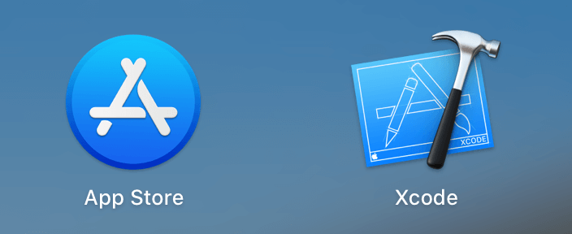
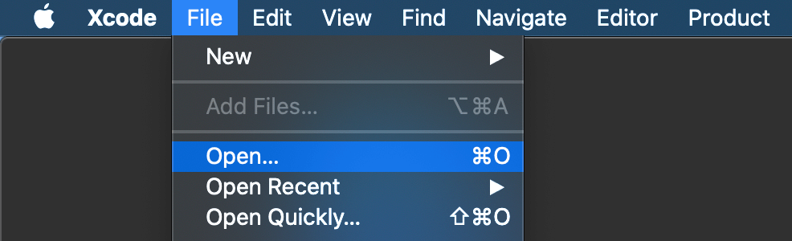
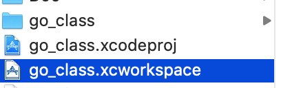
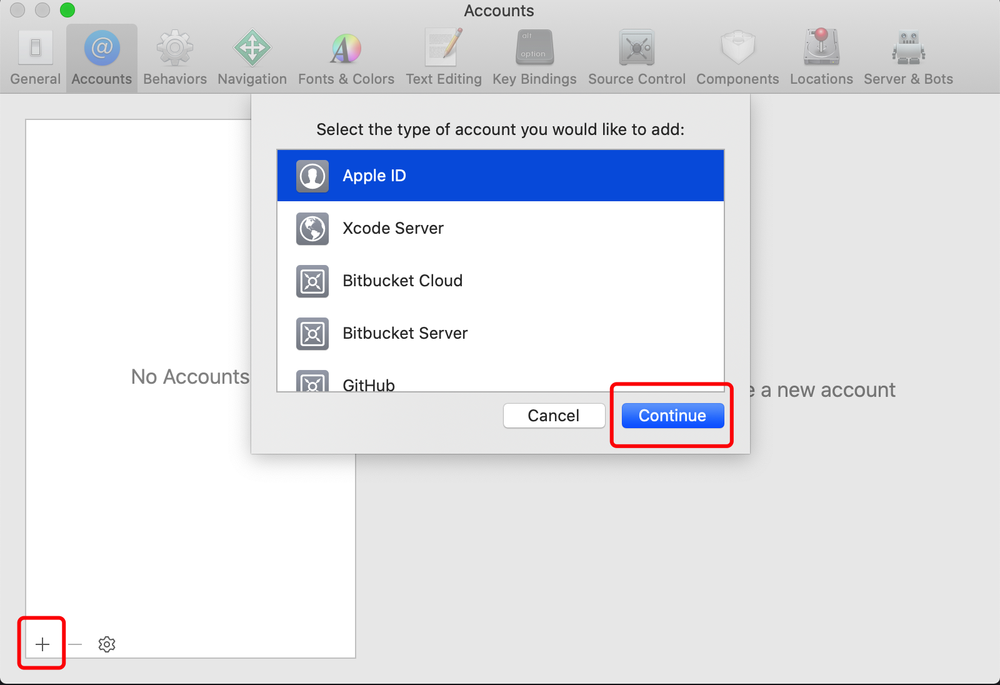
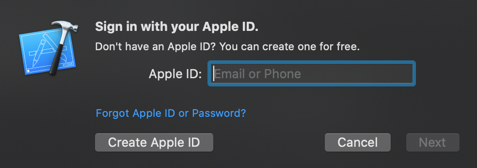
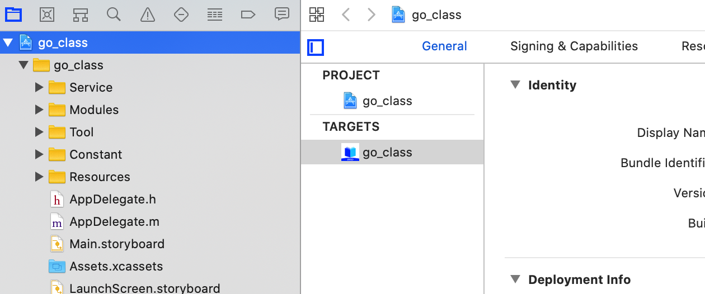
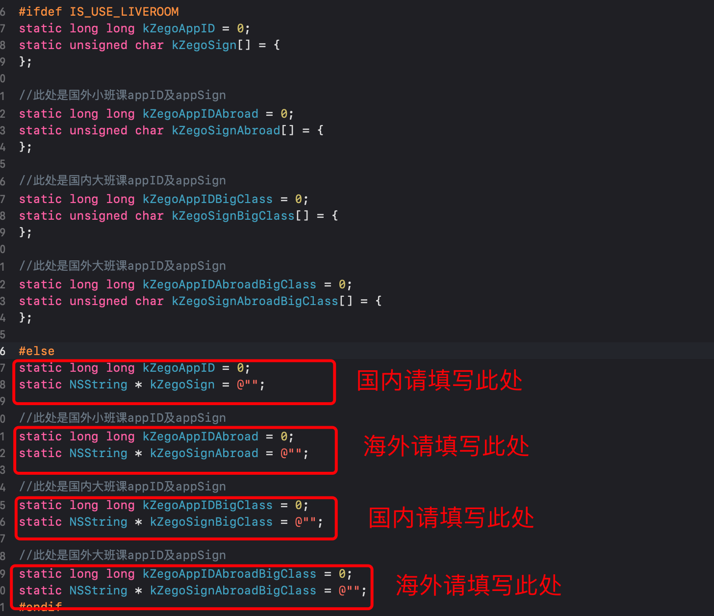
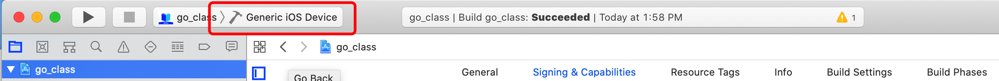
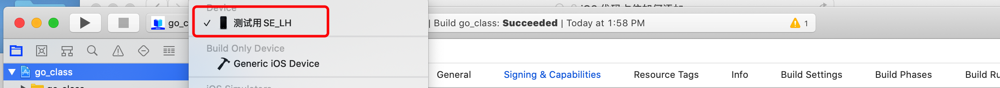
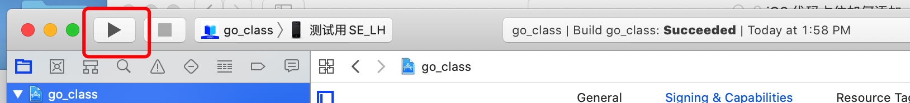

# 简介

go_class_ios 是一个集成即构 Express-Video SDK，互动白板和文件共享的功能示例项目，目的是提供一个场景让用户可以更具像化的了解即构的互动白板和文件共享的功能和使用场景。开发人员可以参考该项目，实现自己的项目。本项目是采用objective-c编程语言开发出来的iOS应用。

# 快速开始

#### 环境准备：

* Xcode 7.0 或以上版本 
* iOS 9.0 或以上版本且⽀持⾳视频的 iOS 真机（欲使用模拟器调试请前往官网获取相关sdk并替换）
* iOS 设备已经连接到 Internet
* 在执行以下步骤之前，请确保已安装 CocoaPods。安装 CocoaPods 的方法以及常见问题可参考 [CocoaPods 常见问题：安装 CocoaPods](https://doc-zh.zego.im/zh/1253.html)
* 打开终端，`cd` 进入你的项目的根目录，并执行 `pod repo update` 更新本地索引 
* 执行 `pod install`

#### 前提条件
请在 [即构管理控制台](https://console.zego.im/acount) 申请 SDK 初始化需要的 AppID 和 AppSign，申请流程请参考 ([项目管理](https://doc-zh.zego.im/zh/1265.html))

#### 运行示例代码
1. AppStore 搜索 Xcode 并下载安装 
   
     

2. 使用Xcode：go_class.xcworkspace 
-     Xcode,选择左上角的File>open...
      
     

-     在解压后的示例代码文件夹中选择go_class.xcworkspace，并初始化Open
          
     
     
3. cd到当前项目目录下

3. 登录Apple ID账号。
-     Xcode，选择左上角的Xcode> Preference。
-     单击Account选项卡，设定左下角的+号，选择添加Apple ID后指示灯Continue。
      
    
    
-    输入Apple ID和密码以登录。
     
   

4. 修改开发者证书和捆绑包标识符。
-     Xcode，预设左侧的go_class项目。
      
    

-    显示Signing & Capabilities选项卡，在Team中选择自己的开发者证书。
     
   

5.下载的示例代码中所需的SDK初始化所需的`AppID`和`AppSign`，需要修改go_class/Constant目录下的`ZegoAuthConstants.h`文件，请使用此“条件条件”已获取的AppID和AppSign正确填写，否则示例代码无法正常运行。

   
    

6.将iOS设备连接到开发电脑，依次Xcode左上角的Generic iOS Device选择该iOS设备。

   

   

7.单击Xcode左上角的Build按钮编译和运行示例代码

   

# 获取帮助

ZEGO 文档中心有关于 [小班课](https://doc-zh.zego.im/zh/5308.html) 以及 [大班课](https://doc-zh.zego.im/zh/6347.html) 相关介绍。

# 作出贡献
如果您发现了文档中有表述错误，或者代码发现了 BUG，或者希望开发新的特性，或者希望提建议，可以[创建一个 Issue]()。请参考 Issue 模板中对应的指导信息来完善 Issue 的内容，来帮助我们更好地理解您的 Issue。

# FAQ

# LICENSE
